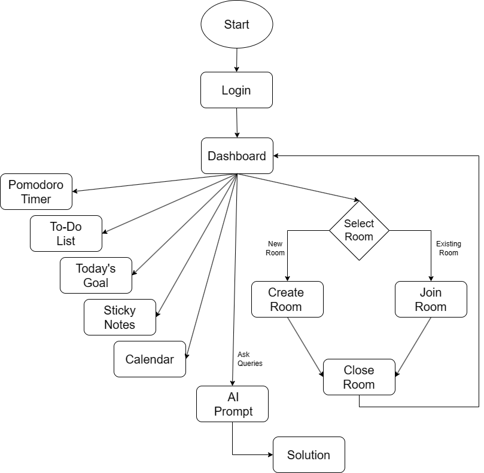
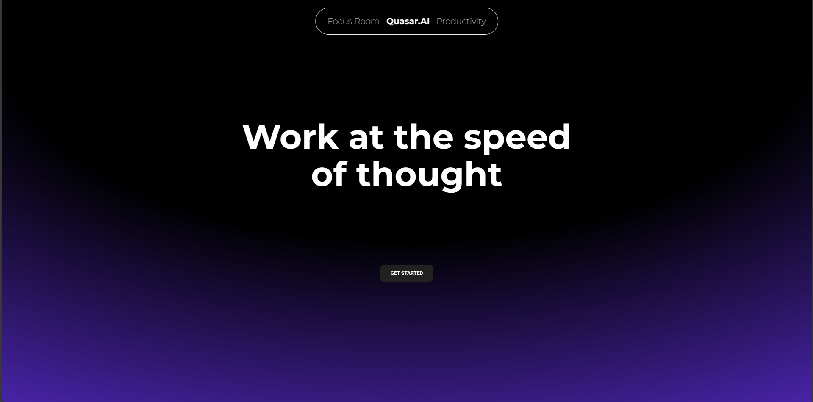
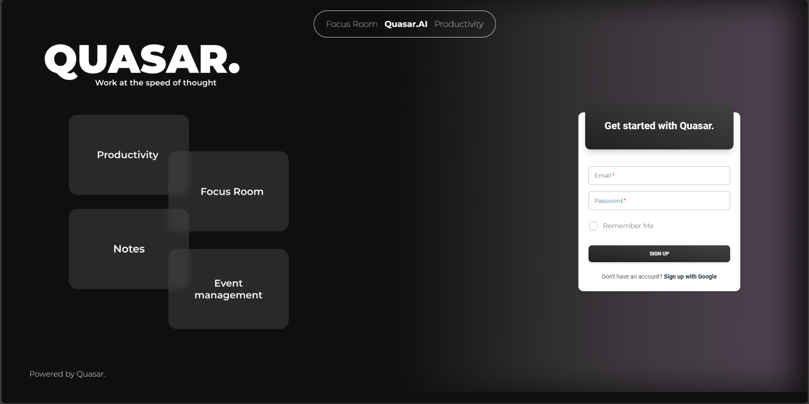
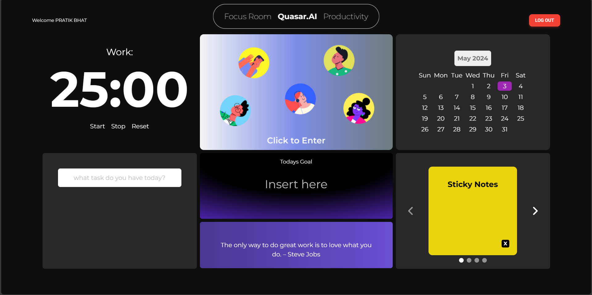
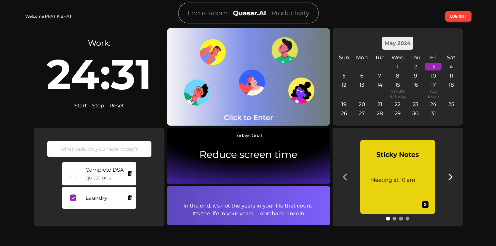
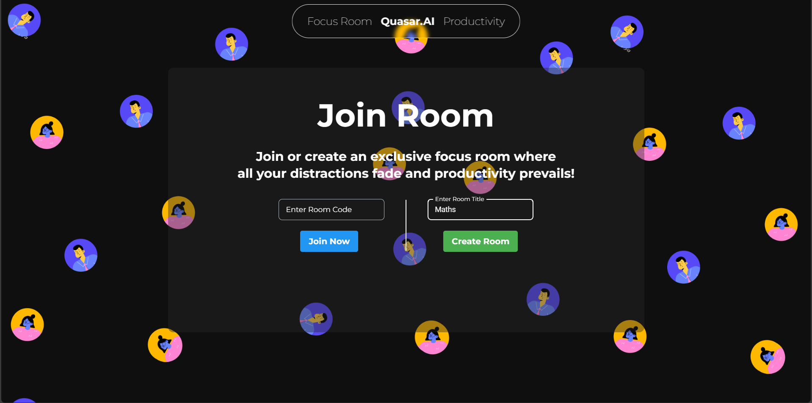
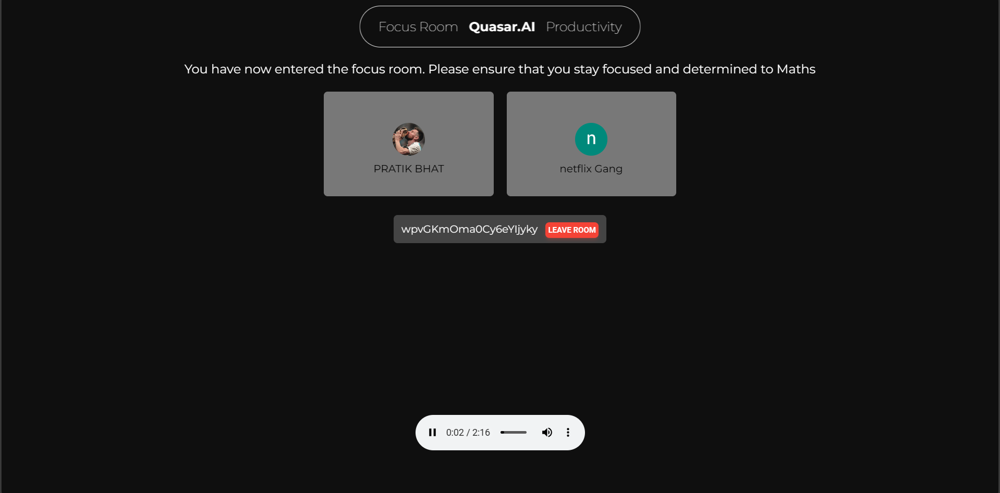
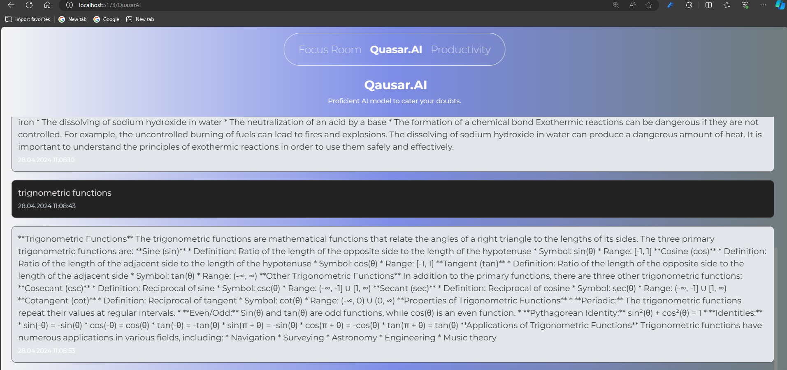

# Quasar
Quasar is a productivity platform designed to optimize workflow and task management. It integrates a range of tools, including a Pomodoro timer, calendar, to-do lists, motivational quotes, and sticky notes, alongside an AI-powered "Focus Room" feature for collaborative and distraction-free work sessions.

## Features
- Pomodoro Timer: Enhance productivity with structured work intervals and breaks.
- Calendar & To-Do Lists: Plan, organize, and track your tasks seamlessly.
- Motivational Tools: Stay inspired with quotes and customizable sticky notes.
- Focus Room: Collaborate with peers in virtual rooms for concentrated discussions and teamwork.
- AI Assistance: Powered by Google’s Gemini API, the integrated AI assistant provides instant guidance and solutions to user queries.
  
## Technologies Used
- Frontend: React.js, HTML, CSS.
- Backend: Node.js, JavaScript.
- AI Integration: Google’s Gemini API.
- Development Optimization: Vite.js for efficient development and hot reloading.
- Authentication: Google Firebase for secure user authentication.
  
## System Architecture
- Frontend: Built with React.js for dynamic and responsive UI.
- Backend: Node.js ensures efficient server-side operations and API management.
- AI Model: The "Quasar AI" prompt system delivers real-time assistance.
- User Authentication: Google Firebase secures user data and login credentials.

## How to Use
Make sure you have node.js installed

Clone the repository:
```bash
git clone https://github.com/yourusername/focus-room-web-app.git
```

Navigate to the project directory:
```bash
cd focus-room-web-app
```

Open command prompt & Install dependencies:
```bash
npm i
```

Start the development server:
```bash
npm run dev
```

Access the application at http://localhost:3000.

## Flowchart

   <p align="center">
  
</p>  

---

## Results
## 1. Index Page

<p align="center">
  
</p>  

---

## 2. Login Page

<p align="center">
  
</p>  

---

## 3. Widgets

<p align="center">
  
</p>  

---

<p align="center">
  
</p>  

---

## 4. Meet Functionality

<p align="center">
  
</p>  

---

<p align="center">
  
</p>  

---

## 5. AI prompt

<p align="center">
  
</p>  

---

## Future Enhancements
- Real-Time Collaboration: Audio/video conferencing and in-room chat for seamless teamwork.
- Advanced NLP: Enhanced AI prompt capabilities and multilingual support.
- Analytics: Usage tracking for insights into user behavior and feature optimization.

---

## Contributors

- Pratik Bhat
- Harsh Deshmukh
